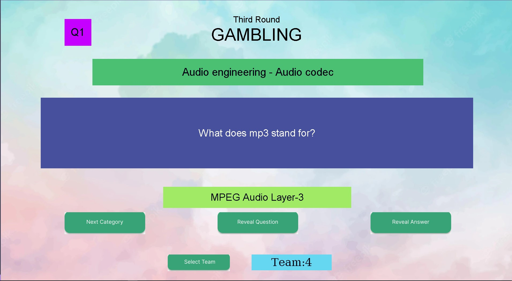

# Quiz-app

An application designed for quiz competitions, particularly in the gambling round. The application features a user interface that showcases various categories of questions along with their corresponding answers. Additionally, the application includes a function for randomly selecting teams. App is designed using tkinter.

## How to use

1. Run `pip install requirements.txt`
2. Run `python3 main.py`
3. Enjoy!

#### NOTE : To edit the design check FrontEnd [Readme](FrontEnd/Readme.md)

### A funny Backstory

This app was built for our quiz competition organised by our student council(which was held the very next day). Having very little knowledge about tkinter , me (Akarsh) and [Atmanand Gauns](https://github.com/tu2-atmanand) designed this entire app within 18 hrs, form morning 10 Am to late night 3 Am 😭. Had a great time breaking our head on the code...
